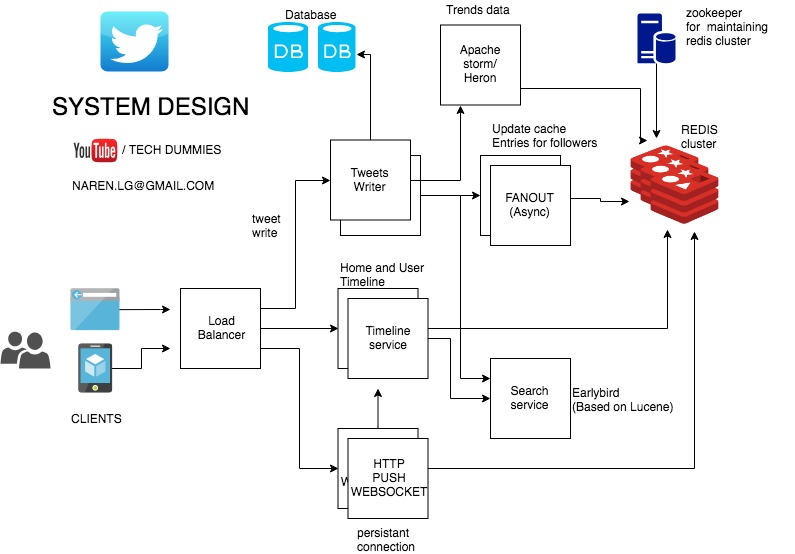
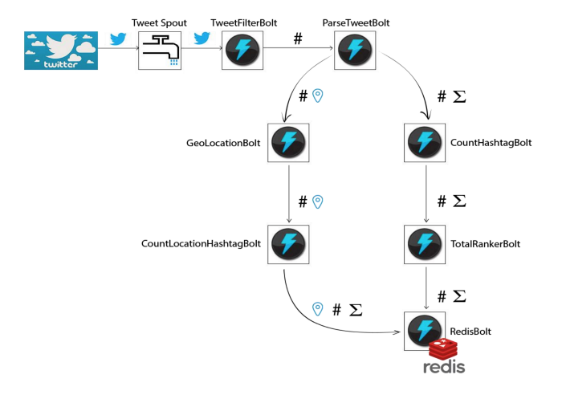

# Twitter
### Tech stack: 
Node.js,React, MySQL, jQuery, Bootstrap,  Redis, Rails, ExpressJS, GraphQL, Scala, Memcached, Hadoop, Mustache, Storm, Hogan.js, GraphQL Ruby, Heron, twemproxy, Distributed LogLabella.js, Pelikan Cache

### Challenges:

- How time line are computed
- How trending hashtag calculated
- Stream processing
- How search works

	
### What happens when we tweet
##### Summary
- User A Tweeted
- Through Load Balancer tweet will flow into back-end servers
- Server node will save tweet in DB/cache
- Server node will fetch all the users that follow User A from the cache
- Server node will inject this tweet into in-memory timelines of his followers
- Eventually, all followers of User A will see the tweet of User A in their timeline

##### Detail
- User tweets something.
- The tweet information passes through load balancers, and hits Twitter’s Write API. 
- The tweet begins to follow a process led by something called the fanout daemon. The daemon first does a query against the social graph service called Flock, and Flock provides a list of the followers of the person who tweeted. 
- The daemon now has the ID of the original user, the tweet ID, and the IDs of all the followers.
- The daemon takes the list of followers and begins to iterate through each of the followers’ home timelines, updating each timeline with the latest tweet information. 
- These timelines are stored in memory within Twitter’s Redis cluster and replicated across data centers on three different machines. For each user, the daemon inserts the Tweet ID (8 bytes) in a native list structure in Redis along with the User ID (8 bytes) and some additional information for retweets, replies, and similar system-centric data (4 bytes). 
- Redis doesn’t store the 140 character tweet information itself nor does it store a list of the entire history of tweets by the users that are followed. Instead, the Twitter engineering team limits Redis to storing the last 800 tweet IDs for each home timeline. Even with this limited amount of information, the Redis cluster uses several terabytes of RAM. This allows the Twitter engineering team to cache almost every single active user’s home timeline in memory at any given time and provide the fastest response times possible. These are also written to disk.

### How twitter dashboard works?
When a user logs in to Twitter or a 3rd party tool that uses the Twitter API, they are presented the home timeline, served from data in the Redis cluster. This is a temporal merge of all the people followed and includes some business rules like stripping out replies for people you don’t follow and visibility of retweets. The timeline contains the ID of all the tweets and those IDs are hydrated or rendered with additional data by pulling data for user objects from a system called Gizmoduck and tweet objects from a system called TweetyPie, each with their own caches.

### What is fan out write and fan out read in scalability?
Fan out write and fan out read are two mutually exclusive architectural choices for building activity feeds. An activity feed has someone writing a post which is going to go to one or many other users.

So if you tweet then that is a write and twitter delivers that to all the subscribers feeds as soon as it is written, fan out write. The work is all done at the time of write to figure out who will get this tweet.

Facebook does not immediately deliver a written post. It waits until users are actually consuming their feed. Facebook at this time looks for posts that have been written that this user is eligible to read; fan out read. The processing of whether a user has permission to read a particular post is done at read time.

How did they decide which architectural approach to use? The answer is in these two cases complexity versus real time. Twitter emphasized real time delivery of tweets while Facebook has lots of complexity about who can see what. Facebook has prioritized the complex analysis needed to decide if a particular post is available to a particular user only when the particular user is ready to see it, which saves up front processing when the post is first written.

### Earlybird: Real-Time Search at Twitter
Earlybird is the system that holds the near real-time index of tweets.

For search, each tweet is tokenized by an ingester that also considers product features and creates the index based on the tags for each word in a tweet. Upon the writing to the index, each Tweet is also ranked by additional information like number of favorites, replies, and retweets. The index is stored in Early Bird machines, a modified Apache Lucene index that is stored in RAM and sharded on a massive cluster, replicating for load.

When a user does a search, a scatter/gather service called Blender queries one of every unique shard for a query match. Blender takes the tweet timeline, merges, re-computes, and sorts the results of a search timeline. Blender also powers the discover page.

### How real time search works
Early Bird uses inverted full-text index. This means that it takes all the documents, splits them into words, and then builds an index for each word. Since the index is an exact string-match, unordered, it can be extremely fast. Hypothetically, an SQL unordered index on a varchar field could be just as fast, and in fact I think you’ll find the big databases can do a simple string-equality query very quickly in that case.
Lucene does not have to optimize for transaction processing. When you add a document, it need not ensure that queries see it instantly. And it need not optimize for updates to existing documents.
However, at the end of the day, if you really want to know, you need to read the source. Both things you reference are open source, after all.
It has to scatter-gather across the datacenter. It queries every Early Bird shard and asks do you have content that matches this query? If you ask for “New York Times” all shards are queried, the results are returned, sorted, merged, and reranked. Rerank is by social proof, which means looking at the number of retweets, favorites, and replies.

### Streaming API
Streaming APIs are not to be confused with multimedia streaming API services like Netflix or Youtube. Industry is starting to use a newer breed of REST APIs called the Streaming APIs to offer a “high-throughput” pipeline to receive curated data. With these APIs you can capture information in real time. It’s perfect if you’re working with a continuous stream that has no defined end like live location updates that you are trying to show in a map.

One more time on the goal – we have something happening right now live and we are trying to provide a means for streaming that live information to say a web or mobile client. Lets assume the clients call a REST API to initiate the streaming call and Streaming APIs need a kick-ass infrastrcuture in the behind. Internally these APIs uses a Transient pub/sub architecture. A Live Stream Processor will publish and API Server will Subscribe. Every stream definition that comes through a new API request will be registered/stored in a persistent datastore. Then the API server opens a pipe to the live stream processor (Imagine any Pub/Sub infra like MQTT pipe or REDIS pub/sub) hoping live stream processor will give the data what the API client needs. On the other hand Live Stream processor which takes real-time streams of data from the real-world runs queries against each of the available stream definitions. The satisfied list of stream definitions are supposed to be pushed to respective pipes opened with API server and in turn to the clients.

### How hashtag trends are computed
Twitter uses Apache Storm and Heron framework to compute trending topics.

These tasks run on many containers, These applications create a real-time analysis of all tweets send on the Twitter social network which can be used to determine the so-called trending topics.

Basically, method implies the counting of the most mentioned terms in the poster tweets in the Twitter social network.
The method is known in the domain of data analysis for the social network as “Trending Hashtags” method. Suppose two subjects A and B, the fact that A is more popular than B is equivalent to the fact that the number of mentions of the subject A is greater than the number of mentions of the subject B

### Databases:
- **Gizzard** is Twitter’s distributed data storage framework built on top of MySQL (InnoDB). InnoDB was chosen because it doesn’t corrupt data. Gizzard us just a datastore. Data is fed in and you get it back out again. To get higher performance on individual nodes a lot of features like binary logs and replication are turned off. Gizzard handles sharding, replicating N copies of the data, and job scheduling.
- **Cassandra** is used for high velocity writes, and lower velocity reads. The advantage is Cassandra can run on cheaper hardware than MySQL, it can expand easier, and they like schemaless design.
- **Hadoop** is used to process unstructured and large datasets, hundreds of billions of rows.
- **Vertica** is being used for analytics and large aggregations and joins so they don’t have to write MapReduce jobs.

### Reference: 
- https://content.pivotal.io/blog/case-study-staple-yourself-to-a-tweet-to-understand-30-billion-redis-updates-per-day

- http://bytecontinnum.com/2015/08/things-you-need-to-know-before-writing-streaming-apis/

- https://medium.com/@narengowda/system-design-for-twitter-e737284afc95

- https://stackshare.io/twitter/twitter
